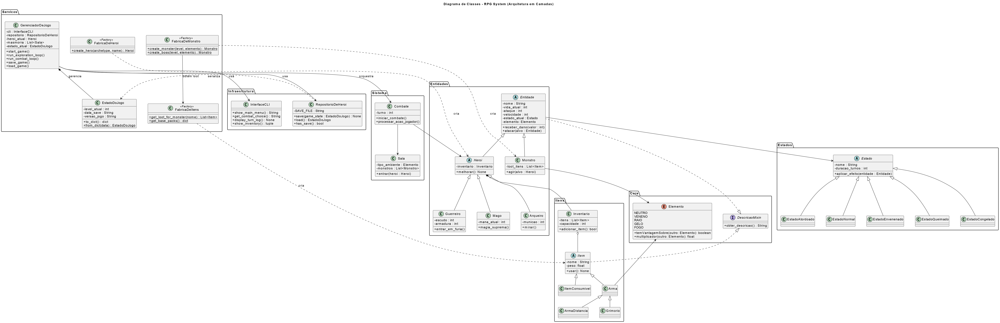

# Projeto 2 — Programação Orientada a Objetos

### DungeonPy — Jogo Dungeon Crawler em Python

---

## 👨‍💻 Equipe

| Nome                         | GitHub                                                   |
| ---------------------------- | -------------------------------------------------------- |
| Leôncio Ferreira Flores Neto | [@LeoncioFerreira](https://github.com/LeoncioFerreira)   |
| Alan Mendes Vieira           | [@alan-mendes-ufca](https://github.com/alan-mendes-ufca) |
| Paulo Gabriel Leite Landim   | [@LandimPG ](https://github.com/LandimPG)                |
| Salomão Rodrigues Silva      | [@salomaosilvaa ](https://github.com/salomaosilvaa)      |
| Cícero Jesus da Silva Gomes  | [@cicero-jesus](https://github.com/cicero-jesus)         |

---

# ⚔️ DungeonPy — Explore & Sobreviva

O **DungeonPy** é um _Dungeon Crawler_ tático desenvolvido em Python.
O projeto foca na exploração de masmorras procedurais e combate elemental por turnos, servindo como base prática para a aplicação de conceitos avançados de **Programação Orientada a Objetos (POO)**.

## 🛠️ Tecnologias e Automação

Para garantir qualidade, padronização e confiabilidade do código, o projeto utiliza as seguintes ferramentas:

- **Gerenciamento de Dependências:** [uv](https://github.com/astral-sh/uv) para instalação rápida e controle de versões (`uv.lock`).
- **Qualidade de Código:** [Ruff](https://github.com/astral-sh/ruff) para _linting_ e formatação automática.
- **Testes Automatizados:** [Pytest](https://pytest.org/) para validação de regras de negócio e comportamento do sistema.
- **CI/CD:** [GitHub Actions](https://github.com/features/actions) para execução automática de testes e análise de código a cada _Pull Request_.
- **Git Hooks:** [Pre-commit](https://pre-commit.com/) configurado para bloquear commits fora do padrão estabelecido.

---

## 🧠 Arquitetura e Programação Orientada a Objetos

O sistema foi projetado para ir além de um CRUD tradicional, priorizando estados mutáveis, encapsulamento e interações polimórficas entre as entidades do jogo.

### 🏗️ Padrões de Projeto Utilizados

- **Strategy:** Permite variar dinamicamente o tipo de ataque conforme o item equipado (`Arma` ou `Grimorio`).
- **State:** Gerencia efeitos temporários como envenenamento e atordoamento durante o combate.
- **Template Method:** Define a estrutura base do algoritmo de ataque na classe `Arma`.
- **Factory Method:** Responsável pela geração procedural e balanceada de monstros conforme o nível do jogador.

### 📐 Estrutura de Classes (UML)

O diagrama abaixo ilustra a estrutura das classes do sistema, evidenciando a aplicação de **Herança** (`Entidade`, `Heroi`, `Monstro`), **Composição** (`Heroi` → `Inventario`) e o uso de **Polimorfismo** no comportamento de ataques e habilidades durante o jogo.



---

## 📁 Estrutura do Repositório

```text
├── .github/workflows/   # Configurações de CI (GitHub Actions)
├── src/                 # Código-fonte do projeto
│   ├── domain/          # Entidades e regras de negócio
│   ├── infra/           # Fábricas e configurações
│   └── services/        # Lógica de combate e sistemas
├── docs/                # Documentação desenvolvida ao longo do projeto
├── tests/               # Testes automatizados
├── pyproject.toml       # Configurações do projeto (uv, Ruff, Pytest)
└── Makefile             # Atalhos para comandos comuns
```

---

## 🚀 Como Executar o Projeto

1. **Instalar dependências:**

```bash
make setup
```

2. **Executar os testes automatizados:**

```bash
make tests
```

3. **Executar o jogo:**

```bash
make run
```
