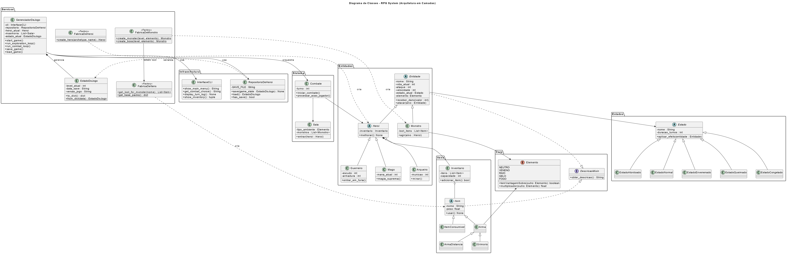

# Projeto 2 — Programação Orientada a Objetos

### DungeonPy — Jogo Dungeon Crawler em Python

---

## 👨‍💻 Equipe

| Nome                         | GitHub                                                   |
| ---------------------------- | -------------------------------------------------------- |
| Leôncio Ferreira Flores Neto | [@LeoncioFerreira](https://github.com/LeoncioFerreira)   |
| Alan Mendes Vieira           | [@alan-mendes-ufca](https://github.com/alan-mendes-ufca) |
| Paulo Gabriel Leite Landim   | [@LandimPG ](https://github.com/LandimPG)                |
| Salomão Rodrigues Silva      | [@salomaosilvaa ](https://github.com/salomaosilvaa)      |
| Cícero Jesus da Silva Gomes  | [@cicero-jesus](https://github.com/cicero-jesus)         |

---

## 📌 Divisão de Responsabilidades

| Integrante                   | Responsabilidades principais                                                                                                               |
| ---------------------------- | ------------------------------------------------------------------------------------------------------------------------------------------ |
| Leôncio Ferreira Flores Neto | Implementação das classes de domínio: `Element`, `Monster`, `Item`, `Inventory`, `Weapon`, `RangedWeapon`; e camada de persistência        |
| Salomão Rodrigues Silva      | Implementação das classes de domínio: `Room`, `Mage`, `Grimoire`, `GameManager` inicial; alterações menores em `CLI`, `Archer` e `Warrior` |
| Paulo Gabriel Leite Landim   | Implementação das classes de domínio: `Entity`, `Archer`, `ConsumableItem`, `CLI`, `LevelFactory`                                          |
| Cícero Jesus da Silva Gomes  | Implementação das classes de domínio: `State`, `ItemsFactory`, `MonsterFactory`, além de apoio em `CLI` e `GameManager`                    |
| Alan Mendes Vieira           | Implementação das classes de domínio:`Hero`, `Warrior`, `HeroFactory`,`Battle`                                                             |

Observação: as responsabilidades foram desenvolvidas de forma colaborativa. A tabela representa as áreas de maior contribuição.

---

# ⚔️ DungeonPy — Explore & Sobreviva

O **DungeonPy** é um _Dungeon Crawler_ tático desenvolvido em Python.
O projeto foca na exploração de masmorras procedurais e combate elemental por turnos, servindo como base prática para a aplicação de conceitos avançados de **Programação Orientada a Objetos (POO)**.

## 🛠️ Tecnologias e Automação

Para garantir qualidade, padronização e confiabilidade do código, o projeto utiliza as seguintes ferramentas:

- **Gerenciamento de Dependências:** [uv](https://github.com/astral-sh/uv) para instalação rápida e controle de versões (`uv.lock`).
- **Qualidade de Código:** [Ruff](https://github.com/astral-sh/ruff) para _linting_ e formatação automática.
- **Testes Automatizados:** [Pytest](https://pytest.org/) para validação de regras de negócio e comportamento do sistema.
- **CI/CD:** [GitHub Actions](https://github.com/features/actions) para execução automática de testes e análise de código a cada _Pull Request_.
- **Git Hooks:** [Pre-commit](https://pre-commit.com/) configurado para bloquear commits fora do padrão estabelecido.

---

## 🧠 Arquitetura e Programação Orientada a Objetos

O sistema foi projetado para ir além de um CRUD tradicional, priorizando estados mutáveis, encapsulamento e interações polimórficas entre as entidades do jogo.

### 🏗️ Padrões de Projeto Utilizados

- **Strategy:** Permite variar dinamicamente o tipo de ataque conforme o item equipado (`Arma` ou `Grimorio`).
- **State:** Gerencia efeitos temporários como envenenamento e atordoamento durante o combate.
- **Template Method:** Define a estrutura base do algoritmo de ataque na classe `Arma`.
- **Factory Method:** Responsável pela geração procedural e balanceada de monstros conforme o nível do jogador.

### 🧩 Justificativa da Modelagem OO

O domínio não é linear: o sistema combina combate por turnos, estados temporários, recursos exclusivos por classe (mana, munição), progressão e persistência.  
Esse cenário exige modelagem orientada a objetos com abstrações, encapsulamento e polimorfismo para evitar lógica procedural com múltiplos `if/else` acoplados.

### 🔄 Ciclo de Vantagens Elementais

- `POISON` tem vantagem sobre `LIGHTNING`
- `LIGHTNING` tem vantagem sobre `ICE`
- `ICE` tem vantagem sobre `FIRE`
- `FIRE` tem vantagem sobre `POISON`
- `NEUTRAL` não possui vantagem elemental

### 🌳 Hierarquias Principais

- **Hierarquia conceitual:** `Entity` (abstrata) → `Hero` (abstrata) / `Monster` (concreta), com especializações `Warrior`, `Mage` e `Archer`.
- **Hierarquia de variação de comportamento:** `State` (abstrata) → `NeutralState`, `PoisonedState`, `BurnState`, `StunnedState`, `FrozenState`.
- **Hierarquia de itens de combate:** `Item` (abstrata) → `Weapon`, `ConsumableItem`; `Weapon` → `RangedWeapon`, `Grimoire`.
- **Herança múltipla (uso consciente):** `Item(ABC, DescriptionMixin)` e `Monster(Entity, DescriptionMixin)`.

### 🔗 Relações de Composição e Agregação

- **Composição 1:** `Hero` possui `Inventory` (o inventário é parte estrutural do herói no ciclo
  de jogo).
- **Composição 2:** `Entity` possui `State` (current_status)
- **Agregação 1:** `Room` agrega `Monster` em sua lista de monstros.
- **Agregação 2:** `Room` agrega `Item` em sua lista de itens.

### 🧱 Arquitetura em Camadas

- `domain/`: entidades e regras centrais de negócio.
- `services/`: casos de uso e orquestração de regras (combate, fábricas, estado de jogo).
- `infra/`: interface CLI e persistência.

Regra de dependência adotada: camadas superiores dependem das inferiores, mantendo o núcleo de domínio independente de infraestrutura.

### ✅ Princípios SOLID Aplicados

- **SRP:** classes com responsabilidades separadas (`Battle`, `HeroRepository`, `ItemsFactory`, `CLI`).
- **OCP:** novas armas/estados/subclasses podem ser adicionadas sem alterar o fluxo central de combate.
- **LSP:** subclasses de `Hero` e `State` substituem suas abstrações sem quebrar o comportamento esperado.
- **DIP:** o fluxo de combate opera sobre abstrações (`Hero`, `Entity`, `State`) em pontos críticos.

### 📐 Estrutura de Classes (UML)

O diagrama abaixo ilustra a estrutura das classes do sistema, evidenciando a aplicação de **Herança** (`Entidade`, `Heroi`, `Monstro`), **Composição** (`Heroi` → `Inventario`) e o uso de **Polimorfismo** no comportamento de ataques e habilidades durante o jogo.



---

## 📁 Estrutura do Repositório

```text
├── .github/workflows/   # Configurações de CI (GitHub Actions)
├── src/                 # Código-fonte do projeto
│   ├── domain/          # Entidades e regras de negócio
│   ├── infra/           # Interface e persistência
│   │   ├── cli.py               # Interface de terminal
│   │   ├── game_manager.py      # Orquestração do jogo
│   │   └── hero_repository.py   # Save/load em JSON
│   └── services/        # Lógica de combate e sistemas
├── docs/                # Documentação e artefatos visuais
│   ├── diagrama-classes.jpeg       # UML de classes
│   └── dungeonpy-documentacao.pdf  # Documento técnico completo
├── tests/               # Testes automatizados
│   ├── domain/          # Testes das entidades, itens, estados e regras do domínio
│   ├── infra/           # Testes da camada de interface/persistência
│   └── services/        # Testes das fábricas e fluxo de batalha
├── pyproject.toml       # Configurações do projeto (uv, Ruff, Pytest)
└── Makefile             # Atalhos para comandos comuns
```

---

## 🚀 Como Executar o Projeto

1. **Instalar dependências:**

```bash
make setup
```

2. **Executar os testes automatizados:**

```bash
make tests
```

3. **Executar o jogo:**

```bash
make run
```

---

## 📎 Artefatos do Projeto

- Diagrama UML: `docs/diagrama-classes.jpeg`
- Documento técnico detalhado: `docs/dungeonpy-documentacao.pdf`
